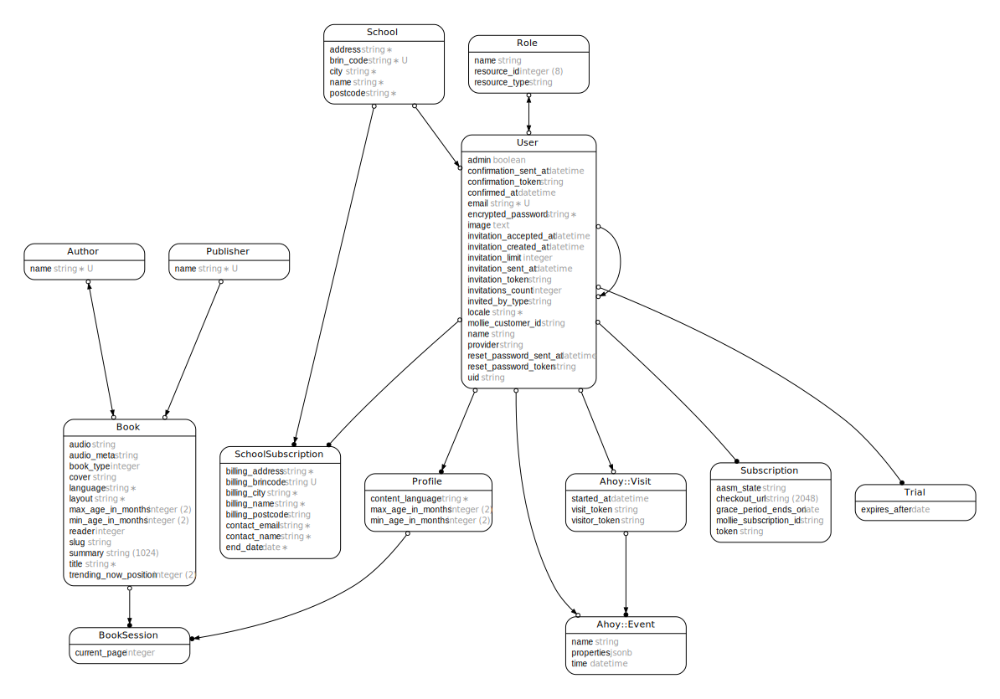

# Wingzzz

[](https://ci.kabisa.nl/job/wingzzz/job/master/)

## Introduction

...

## Prerequisites

- Git, Ruby & PostgreSQL (e.g. using https://gorails.com/setup/osx/10.15-catalina)
- Google Chrome (at least for running cucumber tests, `$ brew cask install google-chrome`)
- [Heroku CLI](https://devcenter.heroku.com/articles/heroku-cli) (if you need to deploy the application, `$ brew tap heroku/brew && brew install heroku`)
- `$ brew install imagemagick` (optionally needed later for converting book-covers, not required to get app running)
- `$ brew install graphviz` (optionally needed later for creating ERD's, not required to get app running)

## Installation

```
$ git clone https://github.com/kabisa/wingzzz
$ cd wingzzz
$ rbenv install `cat .ruby-version` # assuming you use rbenv.
$ bundle install
$ yarn install
$ cp .env.template .env
$ bin/rails db:setup
```

### Mollie

To test payments, make sure you created an account at [Mollie](https://www.mollie.com/). Alternatively you can be added as a member by another user who already has a Mollie account.
Anyhow, you need to create the Mollie **Test API key** to your `.env` file as `MOLLIE_API_KEY`.
Mollie send requests when payments and subscriptions are created or change. To test (Mollie) webhooks locally see [this instruction](doc/local-webhooks.md).

## Managing credentials and configuration

Credentials are stored in environment variables (so we're _not_ using [Rails credentials](https://guides.rubyonrails.org/security.html#custom-credentials)). We use [dotenv](https://github.com/bkeepers/dotenv) to manage them easily in development and test environment ([other environments](https://devcenter.heroku.com/articles/config-vars) have actual ENV variables set).
On installation you already copied an `.env` template. Open this file to set the appropriate values. You also need to create a separate `.env.test` and overwrite the following environment variables:

- `AWS_ACCESS_KEY_ID`
- `AWS_SECRET_ACCESS_KEY`

Consult the **Wingzzz Web** note in LastPass for the values needed.

Wingzzz related configuration settings should all be defined in `config/wingzzz.yml`. This file is handled by Rails' `config_for` so it's environment-aware.
With the `Wingzzz.config` helper, you can easily access configuration settings:

```
Wingzzz.config.books[:storage] # => Rails.application.config_for(:wingzzz).books[:storage]
```

### Rails environments

We stick to using the 3 already included environments in every Rails project. Adding a staging or acceptance environment doesn't make much sense we think.
We like to keep staging, acceptance and production as similar as possible and handle environment specific settings by using ENV variables (this is what Heroku already does, i.e. by defining a `DATABASE_URL`). This means all environments (excluding local development) are running as `Rails.env.production? => true`.

## Running / Development

- `$ bin/rails s`
- `$ bin/webpack-dev-server`
- Visit your app at [http://localhost:3000](http://localhost:3000).
- Preview the [ActionView::Components](https://github.com/github/actionview-component) at [http://localhost:3000/rails/view_components](http://localhost:3000/rails/view_components)
- Preview the Tailwind CSS components at [http://localhost:3000/rails/view_components](http://localhost:3000/rails/view_components)
- Preview the emails at [http://localhost:3000/rails/mailers](http://localhost:3000/rails/mailers) ([more info](doc/mails.md))

### With Overmind

The project also comes with a `Procfile` used by Heroku, which can also be used for development when you have [Overmind](https://github.com/DarthSim/overmind) installed:

- `$ overmind s`
- Make sure to add `OVERMIND_PROCESSES=web,assets` in your `.env` file.
- Visit your app at [http://localhost:5000](http://localhost:5000).

### Populate the database

The project comes with a `seed.rb` which you can use to populate your development environment:

`$ bin/rails db:seed`

We also have a seed that can be used to populate the staging environment:

`$ bin/rails db:seed SEED=staging`

## Running tests

`$ bin/rails ci`

Or individually:

    $ bin/rails rubocop # or `rubocop`
    $ bin/rails lint # or `yarn prettier --check`
    $ bin/rails rspec # or `bin/spec`
    $ bin/rails cucumber # or `bin/cucumber`

## Translations

Translations are managed by Tolk. A[ separate document](doc/i18n.md) describes the process.

## Technical details

### Class diagram



### State machine diagram


To update the diagram, run the following command:

`$ bin/rails diagram:generate`

### CSS

We use [Tailwind CSS](https://tailwindcss.com/) as our CSS framework. To customize Tailwind, make changes to the [config file](./tailwind.config.js) accordingly.

Although most CSS is 'handled' by Tailwind CSS we need a way to structure our CSS to keep it maintainable. A good starting point to get a feel how this is applied, is [`app/javascript/styles/application.scss`](app/javascript/styles/application.scss).

### Payment icons

Icons used to visualize payment methods (e.g. on a user's account page) are downloaded from [Mollie](https://www.mollie.com/resources).

### Fallback images

Cover (thumbnail): [https://dummyimage.com/200x255/333333/fff.jpg&text=No+cover+available](https://dummyimage.com/200x255/333333/fff.jpg&text=No+cover+available)

## Deployment

The application is hosted by Heroku ([staging](https://wingzzz-staging.herokuapp.com/) and [production](https://wingzzz-production.herokuapp.com/)). Detailed instructions about the deployment process can be found [here](https://devcenter.heroku.com/articles/getting-started-with-rails5).

Currently, we using [Heroku CLI](https://devcenter.heroku.com/articles/heroku-cli) to deploy the application, so make sure you have this installed on your machine. Also, in case you have multiple Heroku accounts, [Heroku Accounts](https://github.com/heroku/heroku-accounts) enables you to switch between these accounts easily.

### One time setup instructions

```
$ heroku git:remote -a wingzzz-staging
$ git remote rename heroku wingzzz-staging
$ heroku git:remote -a wingzzz-production
$ git remote rename heroku wingzzz-production

```

This will add the required configuration to your local `.git/config` file.

### Deployment

```
$ git push [ENV] [BRANCH:]master

or

$ git push [ENV] [TAG^{}:]master

# Examples:
#
# To deploy the develop branch to the staging environment:
$ git push wingzzz-staging develop:master

# To deploy the master branch to the production environment:
$ git push wingzzz-production master

# To tag a commit and deploy this to production:
$ git tag -am v0.1 "v0.1"
$ git push --tags
$ git push wingzzz-production v1.0^{}:master

```

### Run rake tasks

```
$ heroku run rake [TASK] --remote [ENV]

# Examples:
#
# To run database migrations on staging
$ heroku run rake db:migrate --remote staging
```

### Configuration

The following environment variables are added to Heroku:

- `AWS_ACCESS_KEY_ID`
- `AWS_BUCKET_NAME`
- `AWS_SECRET_ACCESS_KEY`
- `HTTP_HOST`
- `RAILS_MASTER_KEY` - the content of `config/master.key`, see "Managing Credentials" earlier in this document.
- `NPM_CONFIG_PRODUCTION` - **false**, when installing node packages Heroku by default installs only the production dependencies, ignoring the development dependencies under devDependencies. By setting the variable devDependencies are included.
- `MOLLIE_API_KEY`
- `SENDGRID_API_KEY`
- `ENABLE_MAILER_PREVIEWS` - only available on production environment. This makes it possible to [show a previews of emails](https://wingzzz-staging.herokuapp.com/rails/mailers) to the customer.
- `FACEBOOK_APP_ID` - application needs to be set up on the Facebook Developer page https://developers.facebook.com
- `FACEBOOK_APP_SECRET`
- `GOOGLE_APP_ID` - Api keys need to be set up on the Google Cloud Console https://console.cloud.google.com
- `GOOGLE_APP_SECRET`


### More info

- [Heroku CLI Commands](https://devcenter.heroku.com/articles/heroku-cli-commands)
- [EPUB Reader docs](doc/epub-reader.md)

## Heroku Scheduler

Scheduled jobs are run using Heroku Scheduler.
Check the scheduler page on Heroku for the concerning environment to see which jobs are involved.
